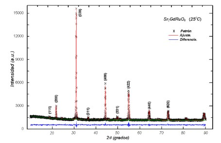
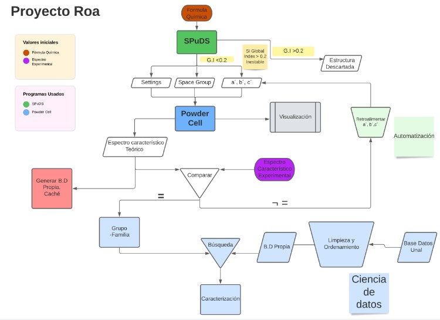
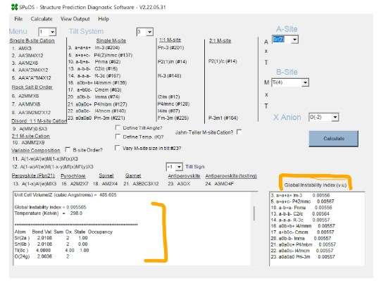
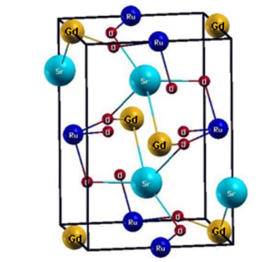
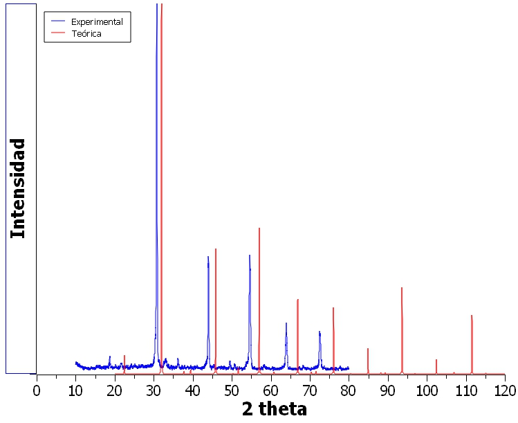
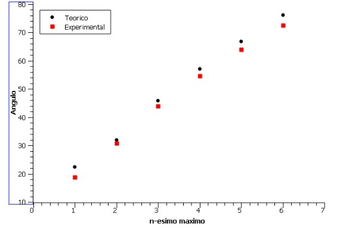

<h1 style="text-align:center;">Caracterización de Perovskitas por medio de la comparación con Base de Datos de UNAL
</h1>

**Reporte No.** 1. Propuesta del proyecto 

**Asesor principal:** Daniel Mauricio Montenegro 

**Autores:**
- Juan Diego Rueda Mantilla
- Juan Esteban Millán Díaz 
- andres Felipe Villalba Cortes

## Introducción
La caracterización de materiales es un proceso de suma importancia en diferentes ramas de la ciencia como Física, Química, Petrología entre otras. Este proceso radica en que por medio de un proceso repetitivo toma una muestra de un material y por medio de diferentes métodos identifica las características intrínsecas ( invariantes a la cantidad de la muestra) del material como : Resistividad eléctrica , Fórmula Química , Módulo de Young entre otros . Simultáneamente, se va guardando esta información con la finalidad de poder identificar a posteriori cualquier material y poder conocer las características de este, sin necesidad de volver  a realizar los procesos que esto conlleva , los cuales generalmente son costosos.
Sin embargo, existe la problemática de la posterior comparación de la información ya existente con una nueva muestra. Generalmente los dataset no son sencillos de comprender y por consiguiente la posibilidad de poder aprovechar este conocimiento previo se perdería. Es justamente este problema en el cual nos encontramos y hemos decidido solucionarlo para una temática en específico como lo es la caracterización de los minerales denominados como **Perovskitas**.

La perovskita es un mineral relativamente raro en la corteza terrestre y posee unas características especiales en su estructura atómica y sus propiedades macroscópicas. Es por esto que este tipo de mineral ha tenido gran importancia en los últimos años debido a su uso en la fabricación de células solares. Existen miles de variantes, familias y subgrupos de perovskitas, las cuales al momento de extraer de la tierra no son diferenciables a simple vista. 
Un método utilizado para diferenciar y caracterizar las perovskitas es la **espectroscopía de rayos x**, la cual a grandes rasgo realiza una incidencia de rayos X sobre la muestra a diferentes ángulos y la difracción que esta genera  reflejada en una variación de intensidad de corriente en un sistema integrado (esta información se ve representada en un llamado espectro característico , ver Figura 1)  permitiendo identificar las posibles estructuras atómicas que esta muestra posee.

<h1 style="font-size:100%;text-align:center;color:grey;">Fig 1. Ejemplo de Espectro característico de una perovskita  	Sr_2GdRu0_6
</h1>

Desde hace bastantes años se ha realizado una biblioteca de perovskitas a nivel mundial, en las cuales están  organizadas de una forma de dificil acceso, por lo cual una persona que tenga una muestra de perovskita y le realice una espectroscopía de rayos x para poder obtener su espectro característico, al momento de desear buscar la caracterización de esta en la base de datos no podrá realizarla debido a dos razones específicas: La complejidad de la base de datos y el ingreso de su información a esta y que nunca un resultado de un espectro será igual a otro debido a razones físicas. 
Finalmente, nuestro proyecto irá dirigido justamente a arreglar estas dificultades. Primero , realizaremos un puente entre la base de datos ya existente y la persona que desea comparar una muestra por medio de diferentes métodos de limpieza y clustering y por otro lado generamos un programa en lenguaje Python principalmente que por medio de un proceso de automatización permite poder identificar a qué tipo de perovskita pertenece la muestra variando los parámetros de la estructura hasta que exista una correlación entre el espectro teórico y el experimental. 

## Descripción del problema

-Diagrama de bloques

<h1 style="font-size:100%;text-align:center;color:grey;">Imagen 1. Diagrama de bloques
</h1>

Inicialmente  una persona con su muestra de perovskita tendrá 2 valores iniciales: La fórmula Química del mineral y el espectro característico  experimental posterior a realizar la espectroscopía de rayos x. De forma preliminar se ingresa en el software **SPuD** la fórmula química , la cual nos provee diferentes **outputs** de los parámetros posibles de la estructura atómica ( Settings , Space Group y a´, b´, c´ ) y el Global Index [^1].

<h1 style="font-size:100%;text-align:center;color:grey;">Imagen 2. Software SPuDS
</h1>

Al tener estos valor, serán ingresados en el siguiente programa llamado Powder Cell , el cual me permite visualizar  la posible estructura (Ver Fig.2) y partir de esta me genera un espectro característico teórico.

<h1 style="font-size:100%;text-align:center;color:grey;"> Fig2. Ejemplo de estructura posible de la Perovskita mencionada en la Fig.1
</h1>

Este espectro característico teórico no se acoplará exactamente con el experimental de la muestra  debido a las posibles variantes que habrá en los outputs generados por SPuDS , por lo cual nuestro siguiente paso será generar un programa que se devuelva a SPuDS para elegir el siguiente posible parámetro de a´, b´, c´ y así sucesivamente hasta encontrar el que mejor coincida con el espectro experimental.

<h1 style="font-size:100%;text-align:center;color:grey;"> Fig 3. Comparación del espectro experimental con un espectro generado por PWC
</h1>

Posteriormente,  ya teniendo el modelo más óptimo. Se elegirá este y se buscará en la base de datos ya reorganizada y con facilidad de acceso para poder identificar las características que esta posee. 

Para definir detalles en el manejo de datos de la base de datos, realizaremos la limpieza primeramente de las celdas que tengan valores inválidos o  de tipo Nan que no se han guardado correctamente a lo largo del tiempo. Después realizaremos un reagrupamiento por Familia, Grupos y Subgrupos de cada perovskita para al poder ingresar los valores teóricos resultantes de la primera parte poder obtener y reflejar las características que exactamente esta estructura tiene.

## Fuentes de datos
- Base de datos de la caracterización de perovskitas generado por los diferentes estudios que se han realizado en la Universidad Nacional.
- Base de datos generada por los software SPuDS y Power cell, la cual va a tener los posibles espectros característicos de diferentes perovskitas dependiendo de la pertenencia a un grupo espacial y a una familia, además se va a ver condicionada a la longitud de los vértices de la celda unitaria ( de la estructura de la molécula de la perovskita).

## Procesamiento ETL
Para la base de datos generada por la automatización, la extracción de información comienza desde el reconocimiento del compuesto por su fórmula química, con la cual se determina la familia a la que este pertenece. Posteriormente se recorre cada uno de los grupos posibles para dicho compuesto y se varían los parámetros a’, b’ y c’ (tal y como se explicó en la descripción del problema). De esta forma, se transforma el espectro experimental en una lista que contiene la posición de los máximos de intensidad para así compararlos con los máximos de los espectros de característicos de la base de datos.

Por otra parte, para la base de datos de la universidad se realizará el siguiente proceso. Lo primero es recibir un archivo txt proveniente del laboratorio de difracción de rayos x, el cual será limpiado y organizado de tal manera que se obtenga un data frame, en donde se tenga especificados por medio el clustering del compuesto, la familia, el grupo y los parámetros.

## Exploración de los datos

La exploración parte de la base de datos creada por los dos software que se describieron al principio, esta base de datos va a estar clasificada por las propiedades que pueda tener el mineral estudiado,  partiendo de la familia a la que pertenece,  seguido de los posibles grupos que se pueden identificar como estables (usando el índice de estabilidad), teniendo en cuenta el grupo se obtiene las coordenadas de los máximos del espectro característico que depende de la longitud de los vértices de la celda unitaria. Siendo estas las coordenadas que se van a comparar con los máximos de intensidad del espectro característico experimental. Por el ruido generado en la difracción de rayos x, se van a discriminar ciertos máximos que se pueden encontrar en el espectro. Esta discriminacion va a estar definida por la intensidad de los menores máximos encontrados en la base de datos de la Unal como en la creada.

Como fue descrito en la introducción el desplazamiento del espectro característico va a depender de la longitud de la celda unitaria, teniendo en cuenta esto el grupo espacial del material representa la separación de los máximos del espectro, lo cual es un aspecto más para poder discriminar un grupo importante de datos que se pueden relacionar con el experimental.

Distancia euclidiana del espacio (n-ésimo máximo relativo vs Ángulo): Con esta técnica buscamos encontrar la mínima distancia entre 
 pares de los máximos de cada espectro característico, lo cual nos permite hallar el valor teórico más cercano al experimental. Este cálculo se realiza minimizando la distancia entre el n-ésimo máximo más cercano del cálculo teórico con el experimental en el espacio 

Correlación: Con esta técnica podemos relacionar el patrón que genera la ubicación de cada máximo de la misma difracción con el patrón que se puede apreciar en la difracción experimental, se espera que el patrón que generen las difracciones de diferentes grupos espacial sean diferentes  y así poder discriminar los corregimientos que se pueden generar por la longitud de la celda unitaria de el grupo especial que no comparta patrón con el esperado.

Clusterización: es un proceso no supervisado de machine learning que consiste en separar o categorizar un dataset en un número de grupos, basado en la similaridad de los datos, agrupando aquellos con características similares en un mismo cluster y aquellos con características diferentes en otros.

## Muestrqa de los datos

La visualización del procesamiento de datos se puede graficar por medio de la ubicación de los máximos(2 theta) contra el máximo que se mide, un ejemplo de esta visualización se puede generar con los datos expresados en la figura 3, el espectro experimental expresa 6 máximos notables mientras que el espectro teórico presenta 8 máximos para un dominio mayor.

<h1 style="font-size:100%;text-align:center;color:grey;"> Fig 4. Representación de datos para comparar la posición de los máximos para el espectro experimental con el teórico. 
</h1>

Otra manera de visualizar nuestros datos es por medio de la densidad de alguna cualidad de los materiales, tanto como la familia a la que pertenece este como la cantidad de datos que pueden existir en el tipo de grupo espacial. 

## Técnicas de modelación propuestas
Como se puede observar en la figura 4 los datos de cada dispersión, tanto la experimental como la adquirida de la base de datos generan un patrón lineal, de esto podemos generar un modelo de regresión lineal que nos permite adquirir la pendiente de este patrón, esta información nos permite comparar de otra manera las difracciones.  

## Conocimientos requeridos para el desarrollo del proyecto
- Bases de datos relacionales y no relacionales
- SQL
- Python: nivel básico-medio
- Modelos no supervisados
## Resultados esperados
 Para la primera base de datos (aquella generada por la automatización) se espera lograr generar una iteración que obtenga teóricamente la distribución atómica en la celda unitaria, es decir, obtener (para cualquier grupo de valores experimentales) el espectro teórico con la menor incertidumbre que permita la herramienta computacional.

Por otra parte, para la base de datos de la universidad, se espera que posterior a la agrupación de distintos compuestos por características como familia, grupo y cantidad de datos; se obtengan comparaciones experimentales predictivas, que puedan cazar fácilmente con cualquier posible espectro experimental. De esta forma se tiene dos maneras independientes de confirmar la distribución atómica del compuesto y así confirmar sus propiedades eléctricas, magnéticas y térmicas. 
 ## Tiempo de desarrollo esperado

Se espera que el desarrollo del proyecto lleve entre 5 y 6 semanas.

[^1]: El global index (G.I) físicamente representa la estabilidad de la estructura. En caso de ser este mayor a 0.2 la estructura y los valores serán descartados por su inestabilidad estructural

